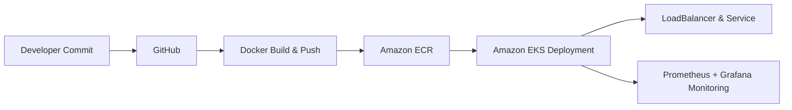
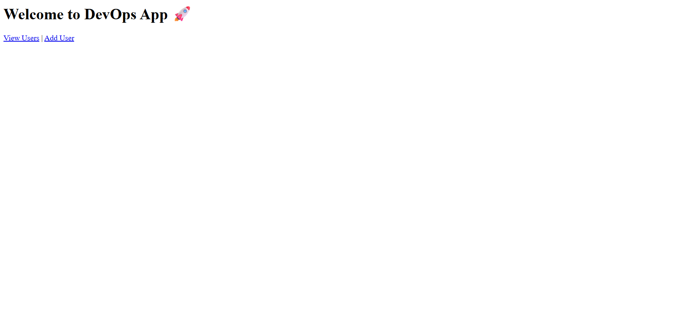
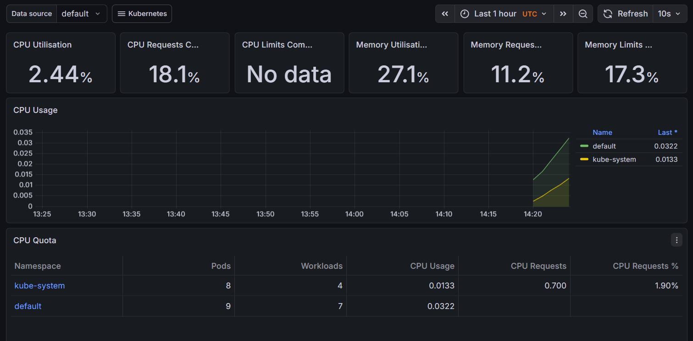

# Production-Grade DevOps Project on AWS EKS

---

## Project Overview
This project demonstrates a **production-ready DevOps workflow** for deploying containerized applications on **Amazon EKS**, showcasing **cloud-native deployment, containerization, monitoring, and automation**.  

It reflects real-world industry practices, highlighting skills sought by top tech companies.

---

## Key Features

- **Containerized Deployment**: Dockerized application deployed on Kubernetes.  
- **Cloud Native Architecture**: AWS EKS cluster with secure access and load balancing.  
- **High Availability**: Auto-scaling and rolling updates for zero downtime.  
- **Monitoring & Observability**: Prometheus + Grafana dashboards and alerts.  
- **Production Best Practices**: Health checks, IAM roles with least privilege, structured logging.  

---

## Technology Stack

| Layer | Tool / Service |
|-------|----------------|
| Containerization | Docker |
| Container Registry | Amazon ECR |
| Orchestration | Amazon EKS, kubectl, eksctl |
| Monitoring & Logging | Prometheus, Grafana |
| Application | Python Flask (demo) |
| Automation | Jenkins / GitHub Actions (optional) |
| Cloud Management | AWS CLI |

---

## Architecture

## Screenshots / Demo

**Application Running on EKS**  

![App User List Screenshot](screenshots/app_user_list.png

**Grafana Monitoring Dashboard**  

