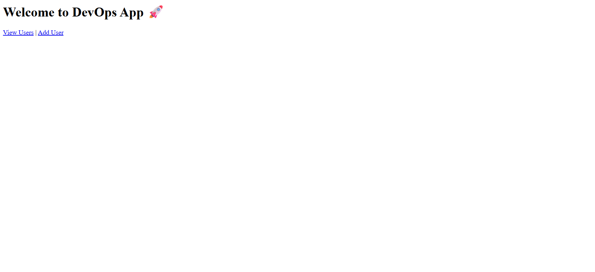
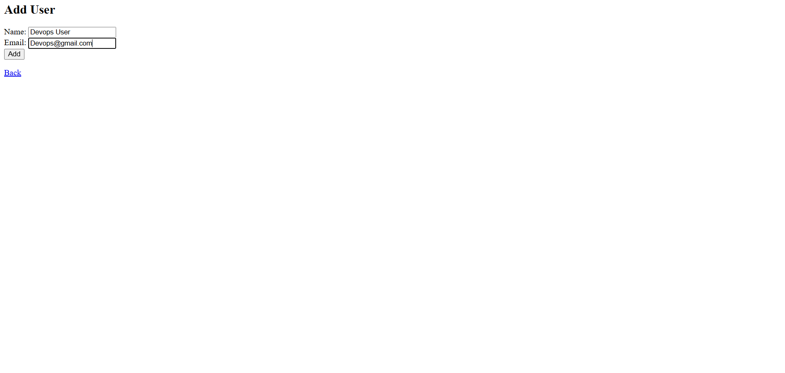
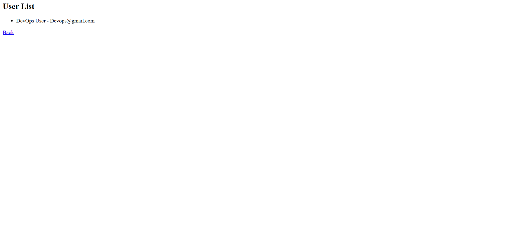
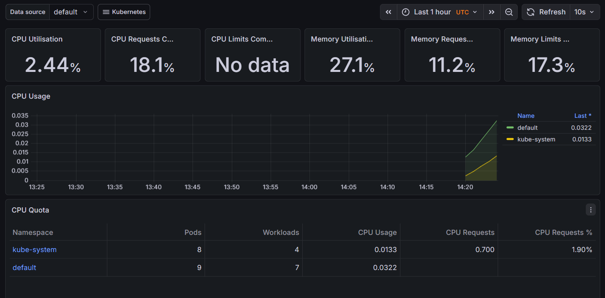

# 🚀 End-to-End DevOps Pipeline: Python App on AWS EKS


> A fully automated CI/CD pipeline that builds, containerizes, and deploys a Python application to AWS EKS using Jenkins, Docker, and Amazon ECR.

---

## 📌 Project Overview

This project demonstrates a production-style DevOps workflow where a Python application is:
- **Containerized** using Docker
- **Stored** in AWS Elastic Container Registry (ECR)
- **Deployed** on AWS Elastic Kubernetes Service (EKS)
- **Automated** end-to-end via a Jenkins CI/CD pipeline

---

## 🏗️ Architecture

```
Developer Push (GitHub)
        │
        ▼
  Jenkins Pipeline
  ┌─────────────────────────────────────┐
  │  1. Checkout Code                   │
  │  2. Build Docker Image              │
  │  3. Run Tests                       │
  │  4. Push Image to AWS ECR           │
  │  5. Deploy to AWS EKS               │
  └─────────────────────────────────────┘
        │
        ▼
  AWS ECR (Image Registry)
        │
        ▼
  AWS EKS (Kubernetes Cluster)
  ┌──────────────────────────┐
  │  Deployment              │
  │  Service (LoadBalancer)  │
  └──────────────────────────┘
```

---

## 🛠️ Tech Stack

| Tool | Purpose |
|------|---------|
| Python | Application runtime |
| Docker | Containerization |
| AWS ECR | Container image registry |
| AWS EKS | Kubernetes cluster hosting |
| Jenkins | CI/CD automation |
| Kubernetes | Container orchestration |
| kubectl | Kubernetes CLI |
| AWS CLI | AWS resource management |

---

## 📁 Project Structure

```
├── app/
│   ├── app.py              # Python application
│   └── requirements.txt    # Python dependencies
├── Dockerfile              # Docker build instructions
├── Jenkinsfile             # CI/CD pipeline definition
├── k8s/
│   ├── deployment.yaml     # Kubernetes Deployment manifest
│   └── service.yaml        # Kubernetes Service manifest
└── README.md
```

---

## ⚙️ Jenkins Pipeline Stages

```groovy
pipeline {
    agent any
    stages {
        stage('Checkout')    { /* Pull code from GitHub */ }
        stage('Build Image') { /* docker build -t my-app . */ }
        stage('Test')        { /* Run unit tests */ }
        stage('Push to ECR') { /* Tag & push image to AWS ECR */ }
        stage('Deploy EKS')  { /* kubectl apply -f k8s/ */ }
    }
}
```

---

## 🚀 Getting Started

### Prerequisites
- AWS Account with EKS cluster and ECR repository created
- Jenkins server with Docker, AWS CLI, and kubectl installed
- IAM roles/permissions configured for ECR and EKS access

### Setup Steps

**1. Clone the repository**
```bash
git clone https://github.com/your-username/python-app-eks-devops.git
cd python-app-eks-devops
```

**2. Configure AWS credentials in Jenkins**
- Add `AWS_ACCESS_KEY_ID` and `AWS_SECRET_ACCESS_KEY` as Jenkins credentials

**3. Update ECR and EKS details in Jenkinsfile**
```groovy
environment {
    ECR_REPO = "your-account-id.dkr.ecr.region.amazonaws.com/your-repo"
    EKS_CLUSTER = "your-cluster-name"
    AWS_REGION = "us-east-1"
}
```

**4. Run the Jenkins pipeline**
- Trigger manually or via GitHub webhook on every push

---

## 📦 Docker

```bash
# Build the image
docker build -t python-app .

# Run locally
docker run -p 5000:5000 python-app
```

---

## ☸️ Kubernetes Deployment

```bash
# Apply manifests
kubectl apply -f k8s/deployment.yaml
kubectl apply -f k8s/service.yaml

# Verify pods are running
kubectl get pods
kubectl get services
```

---

## 📸 Screenshots


**Application Running on EKS**  




**Grafana Monitoring Dashboard**  


---

## 🎯 Key Learnings

- Setting up end-to-end CI/CD with Jenkins and AWS
- Containerizing Python apps with Docker best practices
- Managing container images with AWS ECR
- Deploying and managing workloads on AWS EKS
- Writing Kubernetes manifests for Deployments and Services

---

## 👤 Author

**SATNAM GROVER**
- LinkedIn: [linkedin.com/in/your-profile](https://linkedin.com/in/SATNAMGROVER)
- GitHub: [github.com/your-username](https://github.com/SATNAMGROVER)

---

## 📄 License

This project is open source and available under the [MIT License](LICENSE).
